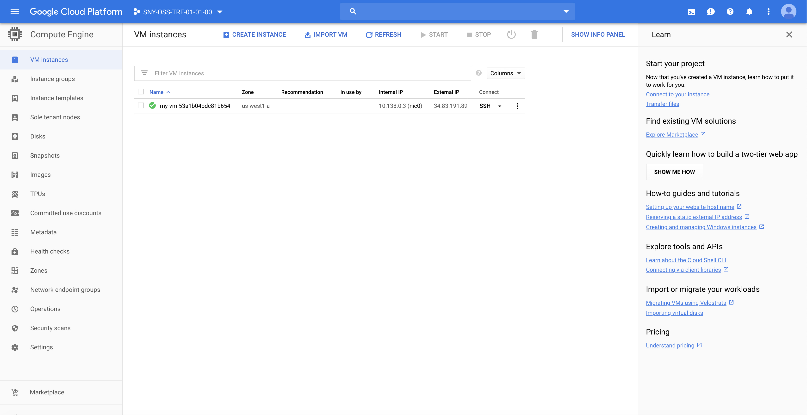

# Getting started

## Configure Terraform (within the VM)

Connect to the VM using ssh

```
$ cd <GIT_REPO_NAME>/vagrant
$ vagrant ssh
```

Move to the right path and create your lab folder

```
vagrant@terraform-vm$ cd ~/$GIT_REPO_NAME/labs/02-Getting_started
```

Create a new directory for the project to live and create a main.tf file for the Terraform config. The contents of this file describe all of the GCP resources that will be used in the project.

```
vagrant@terraform-vm$ mkdir mylab
vagrant@terraform-vm$ cd mylab
vagrant@terraform-vm$ vi main.tf
```

Write the following code into main.tf file (change values accordingly)

```
// Configure the Google Cloud provider
provider "google" {
 credentials = "${file("<CREDENTIALS_JSON_FILE>")}"
 project     = "<GCP_PROJECT_ID>"
 region      = "us-west1-a"
}
```

In the same folder, type terraform init to download Terraform GCP provider 

```
vagrant@terraform-vm$ terraform init

Initializing the backend...

Initializing provider plugins...
- Checking for available provider plugins...
- Downloading plugin for provider "google" (terraform-providers/google) 2.8.0...

The following providers do not have any version constraints in configuration,
so the latest version was installed.

To prevent automatic upgrades to new major versions that may contain breaking
changes, it is recommended to add version = "..." constraints to the
corresponding provider blocks in configuration, with the constraint strings
suggested below.

* provider.google: version = "~> 2.8"

Terraform has been successfully initialized!

You may now begin working with Terraform. Try running "terraform plan" to see
any changes that are required for your infrastructure. All Terraform commands
should now work.

If you ever set or change modules or backend configuration for Terraform,
rerun this command to reinitialize your working directory. If you forget, other
commands will detect it and remind you to do so if necessary.

```

Next you will create a single Compute Engine instance running Debian. For this demo you can use the smallest instance possible  but Terraform/GCP makes it possible to upgrade to a larger instance later. Add the google_compute_instance resource to the main.tf:

```
// Terraform plugin for creating random ids
resource "random_id" "instance_id" {
 byte_length = 8
}

// A single Google Cloud Engine instance
resource "google_compute_instance" "default" {
 name         = "flask-vm-${random_id.instance_id.hex}"
 machine_type = "f1-micro"
 zone         = "us-west1-a"

 boot_disk {
   initialize_params {
     image = "debian-cloud/debian-9"
   }
 }

 network_interface {
   network = "default"

   access_config {
     // Include this section to give the VM an external ip address
   }
 }
}
```

The random_id Terraform plugin allows you to create a somewhat random instance name that still complies with GCP's instance naming requirements but requires an additional plugin. To download and install the extra plugin, run terraform init again.

```
vagrant@terraform-vm$ terraform init

Initializing the backend...

Initializing provider plugins...
- Checking for available provider plugins...
- Downloading plugin for provider "random" (terraform-providers/random) 2.1.2...

...

* provider.google: version = "~> 2.8"
* provider.random: version = "~> 2.1"

Terraform has been successfully initialized!
...
```

You can now validate the work that has been done so far! Run terraform plan which will:

Verify the syntax of main.tfis correct
Ensure the credentials file exists (contents will not be verified until terraform apply)
Show a preview of what will be created
Output:

```
vagrant@terraform-vm$ terraform plan

Refreshing Terraform state in-memory prior to plan...
The refreshed state will be used to calculate this plan, but will not be
persisted to local or remote state storage.


------------------------------------------------------------------------

An execution plan has been generated and is shown below.
Resource actions are indicated with the following symbols:
  + create

Terraform will perform the following actions:

  # google_compute_instance.default will be created
  + resource "google_compute_instance" "default" {
      + can_ip_forward       = false
      + cpu_platform         = (known after apply)
      + deletion_protection  = false
      + guest_accelerator    = (known after apply)
      + id                   = (known after apply)
      + instance_id          = (known after apply)
      + label_fingerprint    = (known after apply)
      + machine_type         = "f1-micro"
      + metadata_fingerprint = (known after apply)
      + name                 = (known after apply)
      + project              = (known after apply)
      + self_link            = (known after apply)
      + tags_fingerprint     = (known after apply)
      + zone                 = "us-west1-a"

      + boot_disk {
          + auto_delete                = true
          + device_name                = (known after apply)
          + disk_encryption_key_sha256 = (known after apply)
          + source                     = (known after apply)

          + initialize_params {
              + image = "debian-cloud/debian-9"
              + size  = (known after apply)
              + type  = (known after apply)
            }
        }
...
```

If everything is ok, then apply the plan
```
vagrant@terraform-vm$ terraform apply

...

Plan: 2 to add, 0 to change, 0 to destroy.

Do you want to perform these actions?
  Terraform will perform the actions described above.
  Only 'yes' will be accepted to approve.

  Enter a value: yes

andom_id.instance_id: Creating...
random_id.instance_id: Creation complete after 0s [id=VPapVgriyvw]
google_compute_instance.default: Creating...

Error: Error loading zone 'us-west1-a': googleapi: Error 403: Access Not Configured. Compute Engine API has not been used in project 28488177485 before or it is disabled. Enable it by visiting https://console.developers.google.com/apis/api/compute.googleapis.com/overview?project=28488177485 then retry. If you enabled this API recently, wait a few minutes for the action to propagate to our systems and retry., accessNotConfigured

  on main.tf line 14, in resource "google_compute_instance" "default":
  14: resource "google_compute_instance" "default" {

```

Click on the link displayed in the error message above, then enable the GCP Compute Engine API


This may take some time, then you should see the following page


```
vagrant@terraform-vm$ terraform apply

An execution plan has been generated and is shown below.
Resource actions are indicated with the following symbols:
  + create

Terraform will perform the following actions:

  # google_compute_instance.default will be created
  + resource "google_compute_instance" "default" {
      + can_ip_forward       = false
      + cpu_platform         = (known after apply)
      + deletion_protection  = false
      + guest_accelerator    = (known after apply)
      + id                   = (known after apply)
      + instance_id          = (known after apply)
      + label_fingerprint    = (known after apply)
      + machine_type         = "f1-micro"
      + metadata_fingerprint = (known after apply)
      + name                 = (known after apply)
      + project              = (known after apply)
      + self_link            = (known after apply)
      + tags_fingerprint     = (known after apply)
      + zone                 = "us-west1-a"

 ...
 Plan: 2 to add, 0 to change, 0 to destroy.

Do you want to perform these actions?
  Terraform will perform the actions described above.
  Only 'yes' will be accepted to approve.

  Enter a value: yes

random_id.instance_id: Creating...
random_id.instance_id: Creation complete after 0s [id=U6GwS9yBtlQ]
google_compute_instance.default: Creating...
google_compute_instance.default: Still creating... [10s elapsed]
google_compute_instance.default: Still creating... [20s elapsed]
google_compute_instance.default: Still creating... [30s elapsed]
google_compute_instance.default: Creation complete after 30s [id=my-vm-53a1b04bdc81b654]

Apply complete! Resources: 2 added, 0 changed, 0 destroyed.

```

If you go to VM instances page, you should see your newly created instance



Remember to destroy resources (active VM cost)

```
vagrant@terraform-vm$ terraform destroy
random_id.instance_id: Refreshing state... [id=VPapVgriyvw]
google_compute_instance.default: Refreshing state... [id=my-vm-54f6a9560ae2cafc]

An execution plan has been generated and is shown below.
Resource actions are indicated with the following symbols:
  - destroy

Terraform will perform the following actions:

  # google_compute_instance.default will be destroyed
  - resource "google_compute_instance" "default" {
      - can_ip_forward       = false -> null
      - cpu_platform         = "Intel Broadwell" -> null
      - deletion_protection  = false -> null
      - guest_accelerator    = [] -> null
      - id                   = "my-vm-54f6a9560ae2cafc" -> null
      - instance_id          = "942803623566960790" -> null
      - label_fingerprint    = "42WmSpB8rSM=" -> null
      - labels               = {} -> null
      - machine_type         = "f1-micro" -> null
...
```
Type yes when prompted