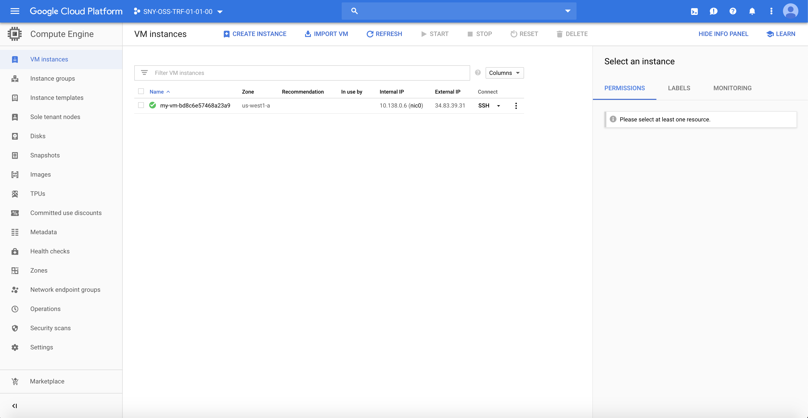

# Accessing the GCP Compute Instance

## Prerequisites

Having completed labs 00, 01, 02. 

If you did not finish lab 02, you can take main.tf file in the solution folder.

## Connect to the Vagrant VM

Connect to the VM using ssh

```
$ cd <GIT_REPO_NAME>/vagrant
$ vagrant ssh
```

## Create an SSH key pair on Vagrant VM

When prompted for the file in which to save the key, accept the default value ```/home/vagrant/.ssh/id_rsa```.
When prompted for the passphrase, accept the default value (no passphrase).

```
vagrant@terraform-vm$ ssh-keygen -t rsa

Generating public/private rsa key pair.
Enter file in which to save the key (/home/vagrant/.ssh/id_rsa): 
Enter passphrase (empty for no passphrase): 
Enter same passphrase again: 
Your identification has been saved in /home/vagrant/.ssh/id_rsa.
Your public key has been saved in /home/vagrant/.ssh/id_rsa.pub.
The key fingerprint is:
SHA256:M9ttFsRZRVvD4XmZVDfhEsOYnUXGwMMYCrqvwtLcsZA vagrant@terraform-vm
The key's randomart image is:
+---[RSA 2048]----+
|       .   .X+O%X|
|      . . .= XBoX|
|     .   .  +..B.|
|      .    .  . .|
|    ..  S   .    |
|   E ..  = . .   |
|  + o o.. . +    |
| . = o.    o     |
|  . ..           |
+----[SHA256]-----+
```

## Prepare for the lab

Move to the right path and create your lab folder

```
vagrant@terraform-vm$ cd ~/$GIT_REPO_NAME/labs/03-Access_to_compute_instance
```

Create a new directory for the project and create a main.tf file for the Terraform config. The content of this file describe all of the GCP resources that will be used in the project.

```
vagrant@terraform-vm$ mkdir mylab
vagrant@terraform-vm$ cd mylab
```

Inside your mylab folder, copy the main.tf file you created in the previous lab; if you did not finish it, you can take the main.tf file in the solution folder.

## Configure SSH access for the Compute Instance

Open the main.tf file and add the following snipped of code within the compute instance resource.

Be sure to replace <INSERT_USERNAME> with your username that will be provisioned into the VM instance.

Username within the VM instance will be your GCP email account, without the @domain.it part and with _ instead of .

For example, denis.maggiorotto@gmail.com will be denis_maggiorotto.

```
resource "google_compute_instance" "default" {
 ...
metadata = {
   ssh-keys = "<INSERT_USERNAME>:${file("~/.ssh/id_rsa.pub")}"
 }
}
```

Initialize Terraform
```
vagrant@terraform-vm$ terraform init
```

Plan the activity (you will see the public key hash being added to the machine)

```
vagrant@terraform-vm$ terraform plan
...
  + resource "google_compute_instance" "default" {
...
   + metadata             = {
          + "ssh-keys" = "terraform:ssh-rsa AAAAB3NzaC1yc2EAAAADAQABAAABAQDEw4lJIQj72iTTgxERChps9dNydCfZPYGUj6tFTmjTNe6HBJtMFQ7V+Fs8QiwFQS9wrkCHMJGk1pRnzqc4DE1QAafFROGHp6gooKfbKXCjU/ZO+LuWaSYKKFiTA5R4hvs76WqdrtfMqCeNqfKmO0ERUkb/QD/PcHRtqytEj60BowCsDQdIZUKeCj3cQ8Me/06l50Xcssh1bUNgze0FCNAanBczbn/5MhCwaqOqPbNatScDMQleeNodCRQxSgdkt+EyOypr+bLXx+VDqV09guHVwZIACpo2ebutHE5j3aoBku1t8CmB3gMi2GapchQZyuSlvO/g/ZkIbPy2nSjMIGx5 vagrant@terraform-vm\n"
        }
...

```

Apply the plan
```
vagrant@terraform-vm$ terraform apply

...
Plan: 2 to add, 0 to change, 0 to destroy.

Do you want to perform these actions?
  Terraform will perform the actions described above.
  Only 'yes' will be accepted to approve.

  Enter a value: yes

random_id.instance_id: Creating...
random_id.instance_id: Creation complete after 0s [id=vYxuV0aKI6k]
google_compute_instance.default: Creating...
google_compute_instance.default: Still creating... [10s elapsed]
google_compute_instance.default: Creation complete after 16s [id=my-vm-bd8c6e57468a23a9]
```


Connect to the GCP Dashboard, you will find the newly created VM instance into the list. There you can see the VM public address (something like 34.83.x.x)




Try to SSH into the new VM instance (change <YOUR_USERNAME> and <YOUR_INSTANCE_IP> accordingly).

```
vagrant@terraform-vm$ ssh -l <YOUR_USERNAME> <YOUR_INSTANCE_IP>

The authenticity of host '34.83.39.31 (34.83.39.31)' can't be established.
ECDSA key fingerprint is SHA256:lBatNZn9qPUM5DZR4UNwtT2AZ0NS8GxMfGhlngeVsKI.
Are you sure you want to continue connecting (yes/no)? yes
Warning: Permanently added '34.83.39.31' (ECDSA) to the list of known hosts.
Linux my-vm-3c0dc5b51c3dd3da 4.9.0-9-amd64 #1 SMP Debian 4.9.168-1+deb9u3 (2019-06-16) x86_64

The programs included with the Debian GNU/Linux system are free software;
the exact distribution terms for each program are described in the
individual files in /usr/share/doc/*/copyright.

Debian GNU/Linux comes with ABSOLUTELY NO WARRANTY, to the extent
permitted by applicable law.
Last login: Tue Jun 25 06:17:54 2019 from 74.125.73.36
denis_maggiorotto@my-vm-3c0dc5b51c3dd3da:~$ 
```

You are now logged into the new VM instance, you can exit with CTRL+d.


Remember to destroy resources (active VM cost)

```
vagrant@terraform-vm$ terraform destroy
random_id.instance_id: Refreshing state... [id=VPapVgriyvw]
google_compute_instance.default: Refreshing state... [id=my-vm-54f6a9560ae2cafc]

An execution plan has been generated and is shown below.
Resource actions are indicated with the following symbols:
  - destroy

Terraform will perform the following actions:

  # google_compute_instance.default will be destroyed
  - resource "google_compute_instance" "default" {
      - can_ip_forward       = false -> null
      - cpu_platform         = "Intel Broadwell" -> null
      - deletion_protection  = false -> null
      - guest_accelerator    = [] -> null
      - id                   = "my-vm-54f6a9560ae2cafc" -> null
      - instance_id          = "942803623566960790" -> null
      - label_fingerprint    = "42WmSpB8rSM=" -> null
      - labels               = {} -> null
      - machine_type         = "f1-micro" -> null
...
```
Type yes when prompted
