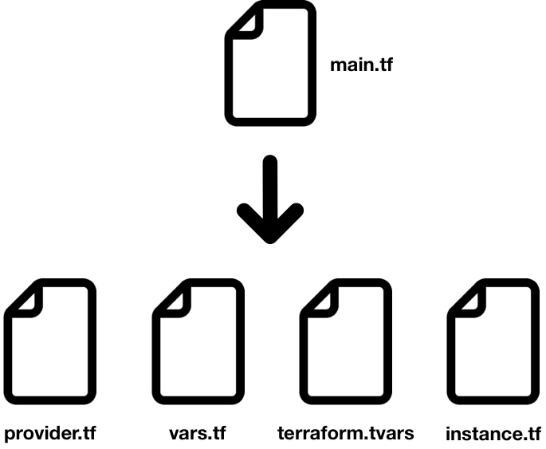

# Split files and use variables

## Prerequisite

Having completed labs 00, 01 and 02. 

If you did not finish lab 02, you can take main.tf file in the solution folder.

## Split main.tf



Connect to the VM using ssh

```
$ cd <GIT_REPO_NAME>/vagrant
$ vagrant ssh
```

Move to the right path and create your lab folder

```
vagrant@terraform-vm$ cd ~/$GIT_REPO_NAME/labs/03-Variables
```

Create a new directory for the project to live and create a main.tf file for the Terraform config. The contents of this file describe all of the GCP resources that will be used in the project.

```
vagrant@terraform-vm$ mkdir mylab
vagrant@terraform-vm$ cd mylab
vagrant@terraform-vm$ vi provider.tf
```

```
```


# Use variables