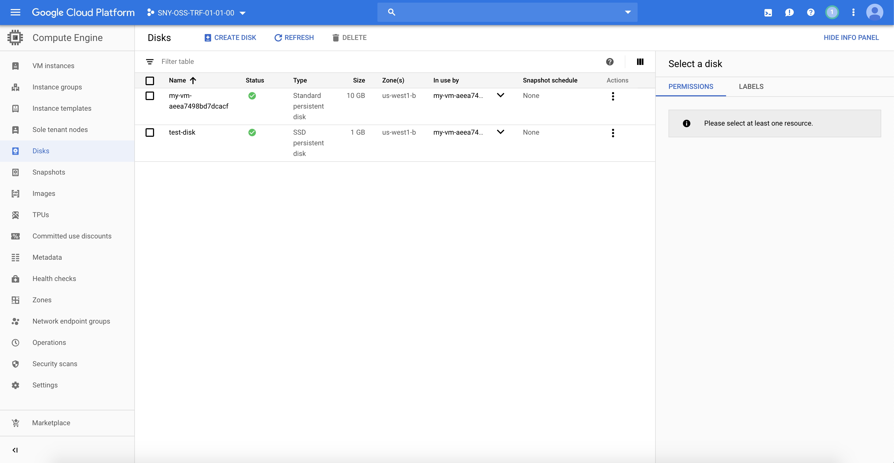

# Manage persistent data

## Prerequisites

Having completed labs 00, 01, 02, and 05. 

If you did not finish lab 05, you can take *.tf files in the solution folder.

## Connect to the Vagrant VM

Connect to the VM using ssh

```
$ cd <GIT_REPO_NAME>/vagrant
$ vagrant ssh
```

Move to the right path and create your lab folder

```
vagrant@terraform-vm$ cd ~/$GIT_REPO_NAME/labs/07-Manage_persistent_data
```

Create a new directory for the project to live and create a main.tf file for the Terraform config. The contents of this file describe all of the GCP resources that will be used in the project.

```
vagrant@terraform-vm$ mkdir mylab
vagrant@terraform-vm$ cd mylab
vagrant@terraform-vm$ cp ../05-Output_variables/mylab/* ./
```

If you haven't complete the 05-Output_variables lab, you can take *.tf files from the solution folder.

Create a new **disk.tf** file and add the following snippet:

```
resource "google_compute_disk" "disk1" {
  name  = "test-disk"
  type  = "pd-ssd"
  zone  = "${var.REGION}"
  labels = {
    environment = "dev"
  }
  physical_block_size_bytes = 4096
  size = 1
}
```

Now open the **instance.tf** file and add this declaration at the bottom of the file (outside any other resource declaration)

```
resource "google_compute_attached_disk" "disk1_attachment" {
  disk = "${google_compute_disk.disk1.self_link}"
  instance = "${google_compute_instance.default.self_link}"
}
```

If you type __terraform init__ and then __plan__, you will see the new disk and disk_attachment resources: 

```
vagrant@terraform-vm$ terraform init
...
vagrant@terraform-vm$ terraform plan
...
Terraform will perform the following actions:

  # google_compute_attached_disk.disk1_attachment will be created
  + resource "google_compute_attached_disk" "disk1_attachment" {
      + device_name = (known after apply)
      + disk        = (known after apply)
      + id          = (known after apply)
      + instance    = (known after apply)
      + mode        = "READ_WRITE"
      + project     = (known after apply)
      + zone        = (known after apply)
    }

  # google_compute_disk.disk1 will be created
  + resource "google_compute_disk" "disk1" {
      + creation_timestamp         = (known after apply)
      + disk_encryption_key_sha256 = (known after apply)
      + id                         = (known after apply)
      + label_fingerprint          = (known after apply)
      + labels                     = {
          + "environment" = "dev"
        }
      + last_attach_timestamp      = (known after apply)
      + last_detach_timestamp      = (known after apply)
      + name                       = "test-disk"
      + physical_block_size_bytes  = 4096
      + project                    = (known after apply)
      + self_link                  = (known after apply)
      + size                       = 1
      + source_image_id            = (known after apply)
      + source_snapshot_id         = (known after apply)
      + type                       = "pd-ssd"
      + users                      = (known after apply)
      + zone                       = "us-west1-a"
    }
...
```

Now apply the plan (type yes when prompted)

```
vagrant@terraform-vm$ terraform apply
...
google_compute_disk.disk1: Destroying... [id=test-disk]
google_compute_instance.default: Creating...
google_compute_disk.disk1: Destruction complete after 4s
google_compute_disk.disk1: Creating...
google_compute_disk.disk1: Creation complete after 5s [id=test-disk]
google_compute_instance.default: Still creating... [10s elapsed]
google_compute_instance.default: Creation complete after 13s [id=my-vm-aeea7498bd7dcacf]
google_compute_attached_disk.disk1_attachment: Creating...
google_compute_attached_disk.disk1_attachment: Creation complete after 9s [id=my-vm-aeea7498bd7dcacf:test-disk]
```

The new disk 'test-disk' has been provisioned, it also appears in Google Dashboard




You should see an output like this, with the ip value under *Outputs:* section

```
..

Outputs:

ip = 34.83.56.48
...
```

If you already cleared the __terrafom apply__ output, you can query the state to obtain the ip output variable.

```
vagrant@terraform-vm$ terraform output ip
34.83.56.48
```
Connect to the VM

```
vagrant@terraform-vm$ ssh -l denis_maggiorotto 34.83.56.48
```
Search for the attached disk

```
denis_maggiorotto@my-vm-aeea7498bd7dcacf:~$ sudo dmesg | grep sd

[    0.000000] Command line: BOOT_IMAGE=/boot/vmlinuz-4.9.0-9-amd64 root=UUID=ee6ea394-7ac2-4959-a423-3ec8bddda3df ro console=ttyS0,38400n8 elevator=noop scsi_mod.use_blk_mq=Y net.ifnames=0 biosdevname=0
[    0.000000] Kernel command line: BOOT_IMAGE=/boot/vmlinuz-4.9.0-9-amd64 root=UUID=ee6ea394-7ac2-4959-a423-3ec8bddda3df ro console=ttyS0,38400n8 elevator=noop scsi_mod.use_blk_mq=Y net.ifnames=0 biosdevname=0
[    1.345622] sd 0:0:1:0: [sda] 20971520 512-byte logical blocks: (10.7 GB/10.0 GiB)
[    1.347683] sd 0:0:1:0: [sda] 4096-byte physical blocks
[    1.349900] sd 0:0:1:0: [sda] Write Protect is off
[    1.350783] sd 0:0:1:0: [sda] Mode Sense: 1f 00 00 08
[    1.350941] sd 0:0:1:0: [sda] Write cache: enabled, read cache: enabled, doesn't support DPO or FUA
[    1.356063]  sda: sda1
[    1.358329] sd 0:0:1:0: [sda] Attached SCSI disk
[    1.503229] EXT4-fs (sda1): mounted filesystem with ordered data mode. Opts: (null)
[    2.235268] EXT4-fs (sda1): re-mounted. Opts: (null)
[    2.644558] sd 0:0:1:0: Attached scsi generic sg0 type 0
[    5.888860] sd 0:0:2:0: [sdb] 2097152 512-byte logical blocks: (1.07 GB/1.00 GiB)
[    5.891294] sd 0:0:2:0: [sdb] 4096-byte physical blocks
[    5.896066] sd 0:0:2:0: Attached scsi generic sg1 type 0
[    5.900561] sd 0:0:2:0: [sdb] Write Protect is off
[    5.902328] sd 0:0:2:0: [sdb] Mode Sense: 1f 00 00 08
[    5.908061] sd 0:0:2:0: [sdb] Write cache: enabled, read cache: enabled, doesn't support DPO or FUA
[    5.924187] sd 0:0:2:0: [sdb] Attached SCSI disk
```

In this example, **sda** is the boot disk, **sdb** is the one we provisioned earlier.

Now you have to partition, format the mount the new disk.

```
denis_maggiorotto@my-vm-aeea7498bd7dcacf:~$ sudo parted /dev/sdb --script -- mklabel msdos
denis_maggiorotto@my-vm-aeea7498bd7dcacf:~$ sudo parted -a optimal /dev/sdb mkpart primary 0% 1024MB

Information: You may need to update /etc/fstab.
denis_maggiorotto@my-vm-aeea7498bd7dcacf:~$  sudo mkfs.ext4 /dev/sdb1
mke2fs 1.43.4 (31-Jan-2017)
Discarding device blocks: done                            
Creating filesystem with 249856 4k blocks and 62464 inodes
Filesystem UUID: 0dc65358-1dea-4751-8872-06abe836839b
Superblock backups stored on blocks: 
        32768, 98304, 163840, 229376

Allocating group tables: done                            
Writing inode tables: done                            
Creating journal (4096 blocks): done
Writing superblocks and filesystem accounting information: done
denis_maggiorotto@my-vm-aeea7498bd7dcacf:~$ sudo mkdir /mnt/test-disk
denis_maggiorotto@my-vm-aeea7498bd7dcacf:~$ sudo mount -t ext4 /dev/sdb1 /mnt/test-disk
denis_maggiorotto@my-vm-aeea7498bd7dcacf:~$ df -h /mnt/test-disk
Filesystem      Size  Used Avail Use% Mounted on
/dev/sdb1       945M  2.4M  878M   1% /mnt/test-disk
```

Now, we can automate the last part using a Terraform provisioner!!!!

Open the instance.tf and copy this snippet within the google_compute_attached_disk resource declaration.

```
provisioner "remote-exec" {
   inline = [
     "sleep 60",
     "sudo parted /dev/sdb --script -- mklabel msdos",
     "sudo parted -a optimal /dev/sdb mkpart primary 0% 1024MB",
     "sudo mkfs.ext4 /dev/sdb1",
     "sudo mkdir dir /mnt/test-disk",
     "sudo mount -t ext4 /dev/sdb1 /mnt/test-disk"
   ]

   connection {
    type     = "ssh"
    host     = "${google_compute_instance.default.network_interface.0.access_config.0.nat_ip}"
    user     = "${var.VM_USERNAME}"
    private_key = "${file("~/.ssh/id_rsa")}"
  }
 }
```
Destroy and recreate all the resources to test the automatic disk partition, format and mount

```
vagrant@terraform-vm$ terraform destroy
...
vagrant@terraform-vm$ terraform plan
...
vagrant@terraform-vm$ terraform apply
...
google_compute_instance.default: Creating...
google_compute_disk.disk1: Creation complete after 5s [id=test-disk]
google_compute_instance.default: Still creating... [10s elapsed]
google_compute_instance.default: Creation complete after 13s [id=my-vm-2f16c8d45ebc4695]
google_compute_attached_disk.disk1_attachment: Creating...
google_compute_attached_disk.disk1_attachment: Provisioning with 'remote-exec'...
google_compute_attached_disk.disk1_attachment (remote-exec): Connecting to remote host via SSH...
google_compute_attached_disk.disk1_attachment (remote-exec):   Host: 35.233.224.79
google_compute_attached_disk.disk1_attachment (remote-exec):   User: denis_maggiorotto
google_compute_attached_disk.disk1_attachment (remote-exec):   Password: false
google_compute_attached_disk.disk1_attachment (remote-exec):   Private key: true
google_compute_attached_disk.disk1_attachment (remote-exec):   Certificate: false
google_compute_attached_disk.disk1_attachment (remote-exec):   SSH Agent: true
google_compute_attached_disk.disk1_attachment (remote-exec):   Checking Host Key: false
google_compute_attached_disk.disk1_attachment: Still creating... [10s elapsed]
google_compute_attached_disk.disk1_attachment (remote-exec): Connected!
google_compute_attached_disk.disk1_attachment (remote-exec): Information: You may need to update
google_compute_attached_disk.disk1_attachment (remote-exec): /etc/fstab.

google_compute_attached_disk.disk1_attachment (remote-exec): mke2fs 1.43.4 (31-Jan-2017)
google_compute_attached_disk.disk1_attachment (remote-exec): Discarding device blocks: done         
google_compute_attached_disk.disk1_attachment (remote-exec): Creating filesystem with 249856 4k blocks and 62464 inodes
google_compute_attached_disk.disk1_attachment (remote-exec): Filesystem UUID: 71dc289d-6c2b-49d8-83d3-a7da535afa76
google_compute_attached_disk.disk1_attachment (remote-exec): Superblock backups stored on blocks:
google_compute_attached_disk.disk1_attachment (remote-exec):    32768, 98304, 163840, 229376

google_compute_attached_disk.disk1_attachment (remote-exec): Allocating group tables: done
google_compute_attached_disk.disk1_attachment (remote-exec): Writing inode tables: done
google_compute_attached_disk.disk1_attachment (remote-exec): Creating journal (4096 blocks): done
google_compute_attached_disk.disk1_attachment (remote-exec): Writing superblocks and filesystem accounting information:    
google_compute_attached_disk.disk1_attachment (remote-exec): done

google_compute_attached_disk.disk1_attachment: Creation complete after 15s [id=my-vm-2f16c8d45ebc4695:test-disk]

```

The output above says that you automated the process.

Remember to destroy resources (active VM cost)

```
vagrant@terraform-vm$ terraform destroy
random_id.instance_id: Refreshing state... [id=VPapVgriyvw]
google_compute_instance.default: Refreshing state... [id=my-vm-54f6a9560ae2cafc]

An execution plan has been generated and is shown below.
Resource actions are indicated with the following symbols:
  - destroy

Terraform will perform the following actions:

  # google_compute_instance.default will be destroyed
  - resource "google_compute_instance" "default" {
      - can_ip_forward       = false -> null
      - cpu_platform         = "Intel Broadwell" -> null
      - deletion_protection  = false -> null
      - guest_accelerator    = [] -> null
      - id                   = "my-vm-54f6a9560ae2cafc" -> null
      - instance_id          = "942803623566960790" -> null
      - label_fingerprint    = "42WmSpB8rSM=" -> null
      - labels               = {} -> null
      - machine_type         = "f1-micro" -> null
...
```
Type yes when prompted


