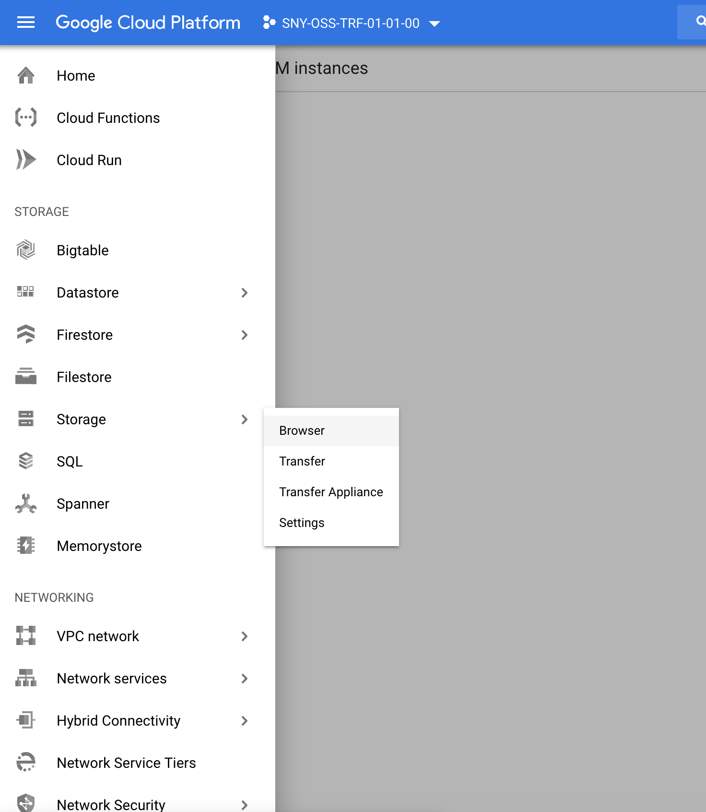
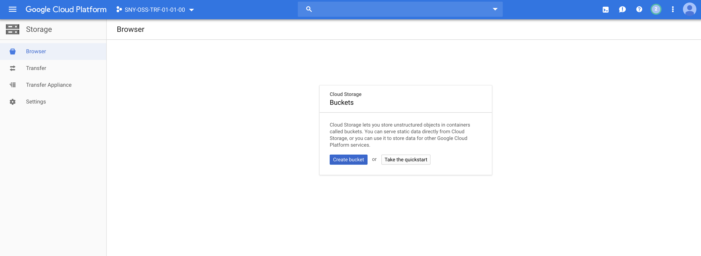
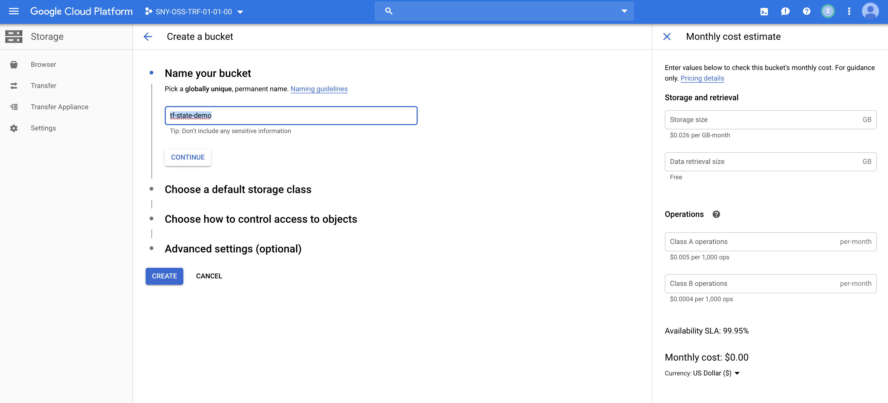
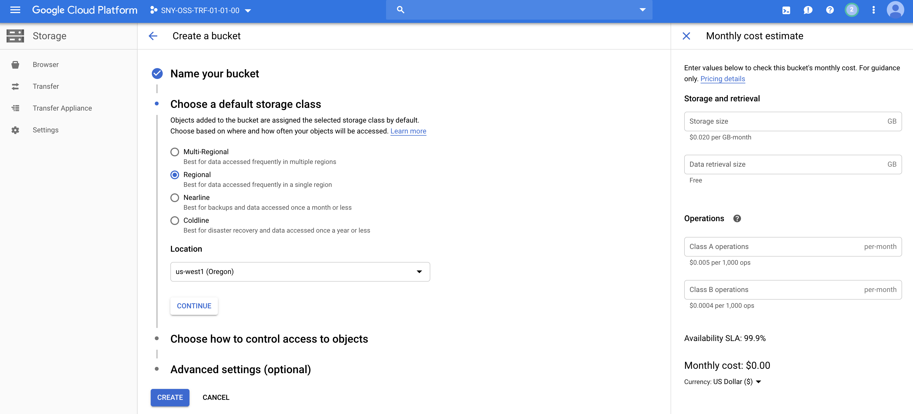
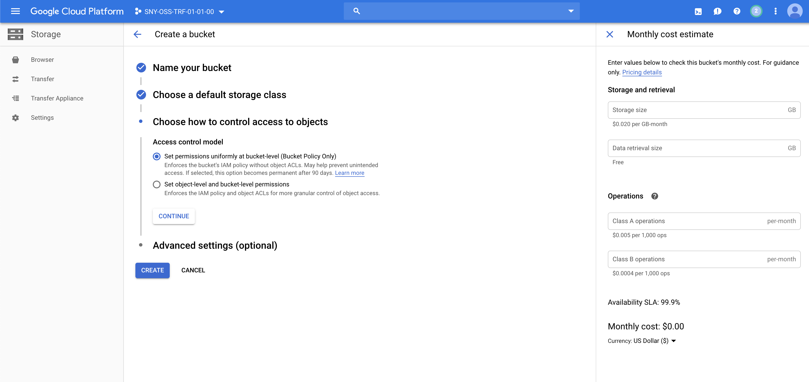
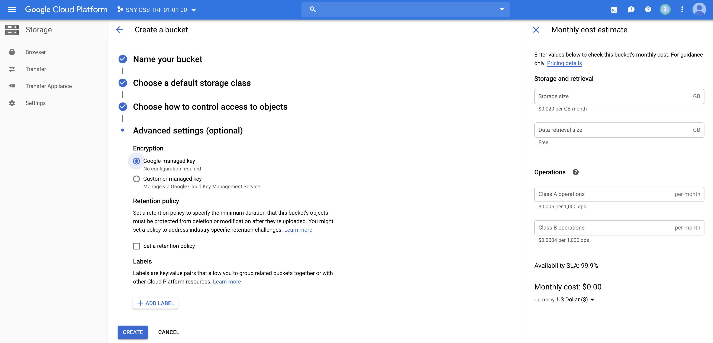
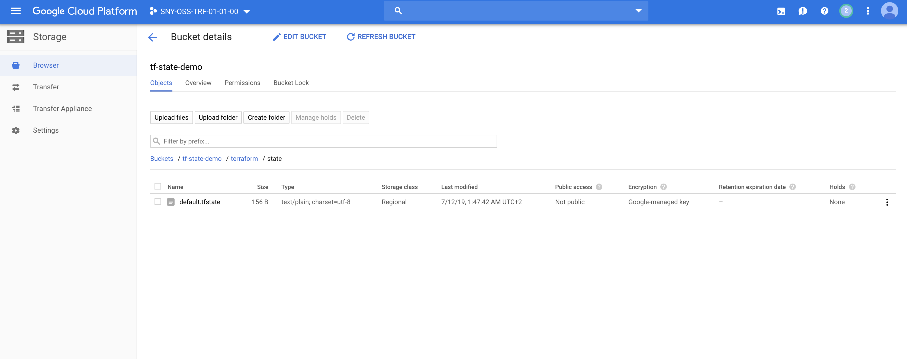

# Sharing the state

In this lab we will use Google Cloud Storage (GCS) to share the Terraform state


## Prerequisites

Having completed labs 00, 01, 02.

Having configured manually a Bucket on Google Cloud Platform, following the steps below:

Click on Storage and then Browser.



Click on Create bucket



Name your bucket **tf-state-demo**, then click Continue



For this demo, we chose a **Regional bucket** located to **us-west1**, then click Continue 



Select **Set permissions uniformly at bucket-level (Bucket Policy Only)**, then click Continue



For this demo, select **Google-managed key**, then click Create



## Connect to the Vagrant VM

Connect to the VM using ssh

```
$ cd <GIT_REPO_NAME>/vagrant
$ vagrant ssh
```

Move to the right path and create your lab folder

```
vagrant@terraform-vm$ cd ~/$GIT_REPO_NAME/labs/11-Sharing_Terraform_state
```

Create a new directory for the project to live and create a main.tf file for the Terraform config. The contents of this file describe all of the GCP resources that will be used in the project.

```
vagrant@terraform-vm$ mkdir mylab
vagrant@terraform-vm$ cd mylab
```

We will create the few files in order to setup the cloud infrastrucure:

- variables.tf
- terraform.tfvars
- providers.tf
- config.tf
- main.tf


First, we create the file **variables.tf** in order to declare the variables we are going to use (and their default value):

```
variable "REGION" {
    default="us-west1"
}
variable "ZONE" {
    default="a"
}
variable "CREDENTIAL_FILE" {}
variable "VM_USERNAME" {}
variable "PROJECT_ID" {}


variable "IMAGE" {
    default="debian-cloud/debian-9"
}

variable "SSH_PUB_KEY_FILEPATH" {
    default="~/.ssh/id_rsa.pub"
}

variable "SSH_PRIV_KEY_FILEPATH" {
    default="~/.ssh/id_rsa"
}

```


Let's create the **terraform.tfvars** file with the actual variables value (chage the placeholders accordingly):

```
CREDENTIAL_FILE="/home/vagrant/<YOUR_FILE_NAME>.json"
PROJECT_ID="<YOUR_PROJECT>"
REGION="us-west1"
ZONE="a"
VM_USERNAME="<YOUR_USERNAME>"
```

Now,  we create the file **providers.tf**, used to configure the GCP provider and the random_id plugin.

```
// Terraform plugin for creating random ids
resource "random_id" "random_id" {
 byte_length = 8
}

// Configure the Google Cloud provider
provider "google" {
 credentials = "${file("${var.CREDENTIAL_FILE}")}"
 project     = "${var.PROJECT_ID}"
 region      = "${var.REGION}"
}
```

Now we configure the Terraform state, create a file **config.tf** and fill it with:

```
terraform {
  backend "gcs" {
    bucket  = "tf-state-demo" // bucket has to be created manually using GCP dashboard before running this demo, variables can not be used here
    prefix  = "terraform/state" // variables can not be used here
    credentials = "/home/vagrant/<YOUR_FILE_NAME>.json" // variables can not be used here
  }
}
```
Remember to change the placeholder <YOUR_FILE_NAME> with the actual file name. Variables can not be used in this file!

In the **main.tf** insert:

```
resource "google_compute_instance" "default" {
 name         = "myvm-${random_id.random_id.hex}"
 machine_type = "f1-micro"
 zone         = "${var.REGION}-${var.ZONE}"
 tags         = ["ssh","http"]


 boot_disk {
   initialize_params {
    image = "${var.IMAGE}"
   }
 }

 network_interface {
   network = "default"
   access_config {
     // Include this section to give the VM an external ip address
   }
 }

  metadata = {
    ssh-keys = "${var.VM_USERNAME}:${file("${var.SSH_PUB_KEY_FILEPATH}")}"
 }

  
}

```

Then try the plan

```
vagrant@terraform-vm$ terraform init
...
Initializing the backend...

Successfully configured the backend "gcs"! Terraform will automatically
use this backend unless the backend configuration changes.
...
vagrant@terraform-vm$ terraform plan
...
vagrant@terraform-vm$ terraform apply
...

```

The single-VM infrastructure will be created. Please note the outputs.

If you go back to GCP dashboard, you can see the shared state:



Remember to destroy resources (active VM cost)

```
vagrant@terraform-vm$ terraform destroy
random_id.instance_id: Refreshing state... [id=VPapVgriyvw]
google_compute_instance.default: Refreshing state... [id=my-vm-54f6a9560ae2cafc]

An execution plan has been generated and is shown below.
Resource actions are indicated with the following symbols:
  - destroy

Terraform will perform the following actions:

  # google_compute_instance.default will be destroyed
  - resource "google_compute_instance" "default" {
      - can_ip_forward       = false -> null
      - cpu_platform         = "Intel Broadwell" -> null
      - deletion_protection  = false -> null
      - guest_accelerator    = [] -> null
      - id                   = "my-vm-54f6a9560ae2cafc" -> null
      - instance_id          = "942803623566960790" -> null
      - label_fingerprint    = "42WmSpB8rSM=" -> null
      - labels               = {} -> null
      - machine_type         = "f1-micro" -> null
...
```
Type yes when prompted


